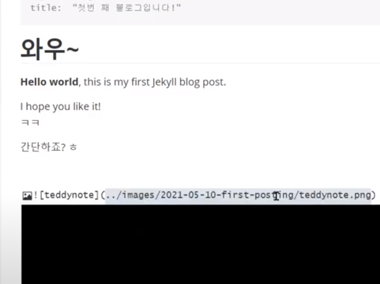

# 와우~

Heelo world, this is my frist Jekkll blog post.

I hope you like it!

ㅋㅋ

```python
# Take a list of numbers
my_list = [12, 65, 54, 39, 102, 339, 221,]

# use anonymous function to filter
result = list(filter(lambda x: (x % 13 == 0), my_list))

# display the result
print("Numbers divisible by 13 are",result)

```

**실시간으로 반영이 되는 것을 보실 수 있나요?**

## 이미지 목차

### 이미지 세부 목차1

이미지입니다.

### 이미지 세부 목차2

이미지입니다.

### 이미지 세부 목차3

이미지입니다.

간단하죠?ㅎ



# 와우2

안녕하세요?
